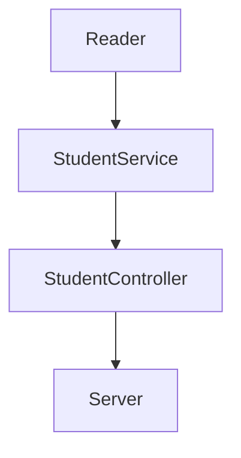

#	:space_invader: Cursos de Visual Thinking API :space_invader:

Visual Partner-Ship te ha asignado el siguiente proyecto:

## :pushpin: Requerimientos:

1. Habilitar un endpoint para consultar todos los estudiantes con todos sus campos.
2. Habilitar un endpoint para consultar los emails de todos los estudiantes que tengan certificación `haveCertification`.
3. Habilitar un endpoint para consultar todos los estudiantes que tengan `credits` mayor a 500.


Imagen por [@carlogilmar](https://twitter.com/CARLOGILMARm "Twitter Carlo Gilmar")

## :chart: Desarrollo

1. Dado los requerimientos se deben tener en cuenta cuáles serán los endpoints y requests de la API:

| Endpoint | Request | Response |
|---|---|---|
| `localhost:3000/v1/students` | `localhost:3000/v1/students` | Devuelve la lista completa de estudiantes |
| `localhost:3000/v1/students/certificated/email` | `localhost:3000/v1/students/certificated/email` | Lista con nombres y emails de estudiantes certificados |
| `/v1/students/credits/greaterthan/:credits` | `/v1/students/credits/greaterthan/500` | Lista de estudiantes con creditos > 500|

2. Dependencias y tecnologías.

:tanabata_tree: Tecnologías usadas:

- [Node JS](https://nodejs.org/es/ "Node Oficial") v13.14.0 (Entorno de ejecución para JavaScript construido con V8, motor de JavaScript de Chrome).
- [NPM](https://www.npmjs.com/ "NPM Oficial") v6.14.4 (Gestor de dependencias para Node JS)
- [Git](https://git-scm.com/ "Git Oficial") v2.31.1 (Sistema de control de versiones)

:mag_right: Dependencias:

- [Express JS](http://expressjs.com/ "Express Oficial") ^4.18.1 (Web framework de Node JS para infraestructura de aplicaciones web y simplificar la creación de APIS).
- [Jest JS](https://jestjs.io/es-ES/ "Jest Oficial") ^28.1.0 (Framework para realizar pruebas unitarias de JS creado por Facebook y de uso popular).
- [Eslint](https://eslint.org/ "Eslint Oficial") ^8.15.0 (Linter que examina código Javascript de acuerdo a ciertas normas y criterios (personalizables por el programador) para que el código Javascript siga unos estándares y estilos de calidad).

3. Crear un proyecto de JS dentro de la carpeta `visual-thinking-api` con las opciones por defecto:

```
npm init --yes
```

4. Inicializar un repositorio dentro de la carpeta `visual-thinking-api`:

```
git init
```
5. Instalar las dependencias necesarias: `Express JS`, `Jest JS` y `Eslinter`:

```
npm install express --save
npm install --save-dev jest
npm install eslint --save-dev
```

6. El siguiente grafico representa la estructura de la solucíón:


- `Reader`: Clase cuya función es leer un archivo.json y devolver el objeto correcto para manipular los datos.
- `StudentService`: Esta clase contendrá la lógica principal. Recibe una solicitud de datos por parte del controlador y devuelve el trabajo completado.
- `StudentController`:  Gestiona las solicitudes HTTP de trabajo entrantes y pasa los datos al servicio. Este es un puente entre services y server

5. Se crearon las clases y archivos necesarios tanto para el flujo de trabajo como para las pruebas unitarias. Para simular datos de una BD se usa el archivo `visualpartners.json`. Se optó por seguir la metodología TDD.

6. Se crea el archivo `test.yml` en `visual-thinking-api/.github/workflows/` con el siguiente github action:

```yml
name: Run Tests in my project every push on GitHub

on: [push]

jobs:
  build:
    runs-on: ubuntu-latest
    steps:
    - uses: actions/checkout@v1
    - name: Install modules
      run: yarn
    - name: Run tests
      run: yarn test
```
Esto automatiza nuestras pruebas con Jest JS al hacer `git push`.

## :shipit: Resultados

- Endpoint 1 Obtener todos los estudiantes:
  - Request => localhost:3000/v1/students

```js
app.get("/v1/students", (request, response) => {
    const listOfStudents = StudentController.getListOfStudents();
    response.json(listOfStudents);
});
```


- Endpoint 2 Obtener los nombres y emails de estudiantes certificados:
  - Request => localhost:3000/v1/students/certificated/email

```js
app.get("/v1/students/certificated/email", (request, response) => {
    const emailListOfStudentsWithCertification = StudentController.getEmailsOfStudentsWithCertification();
    response.json(emailListOfStudentsWithCertification);
});
```


- Endpoint 3 Obtener lista de estudiantes con creditos mayores a 500:
  - Request => localhost:3000/v1/students/credits/greaterthan/:credits

```js
app.get("/v1/students/credits/greaterthan/:credits", (request, response) => {
    const credits = request.params.credits;
    const listOfStudentsGreaterThan = StudentController.getListOfStudentsWithCreditsGreaterThan(credits);
    response.json(listOfStudentsGreaterThan);
});
```


## :open_file_folder: Estructura de carpetas

```
visual-thinking-api
│   .eslintrc.js
│   .gitignore
│   visualpartners.json
│   package-lock.json
│   package.json
│   README.md   
│
└───github
│   └───workflows
│       │  test.yml
|
└───lib
│   └───controllerss
│   │   │  StudentController.js
│   │
│   └───services
│   │   │   StudentService.js
│   │   
│   └───utils
│   │   │   Reader.js
│   │
│   |   server.js
│   
└───test
│   └───controllerss
│   │   │  StudentController.test.js
│   │
│   └───services
│   │   │   StudentService.test.js
│   │   
│   └───utils
│       │   Reader.test.js

```


